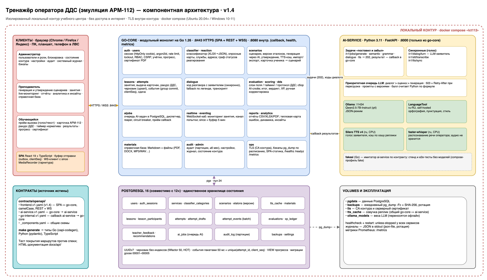

# Общие сведения

## Назначение

Тренажёр — учебное программное обеспечение для подготовки операторов дежурно-диспетчерских служб
(ДДС) города Москвы, взаимодействующих с системой-112. Он имитирует рабочее место АРМ-112
(интерфейс ПОВ-112) в изолированном локальном контуре. С помощью искусственного интеллекта
тренажёр:

- **генерирует учебные сценарии** вызовов и эталонные карточки происшествий по категориям
  классификатора;
- **имитирует звонок заявителя**: голосом (синтез речи) или текстом. Заявитель — языковая модель,
  которая держится легенды и раскрывает факты только в ответ на правильные вопросы;
- **оценивает действия обучающегося**: сверяет карточку с эталоном, проверяет грамматику,
  смысл свободного текста, соблюдение норматива времени и протокол разговора;
- **даёт аналитику** преподавателю: тепловую карту ошибок группы, динамику, инсайты по типичным
  ошибкам с рекомендациями.

Сервис **не** обрабатывает реальные вызовы, не содержит функционала основной системы-112
(только имитация) и не требует доступа во внешние сети.

## Роли пользователей

| Роль | Основные возможности |
|---|---|
| Администратор | Учётные записи и роли, блокировка; состояние контура в реальном времени; настройки (нормативы, веса, голос, бэкапы, срок хранения журналов); журнал аудита; системный журнал; резервное копирование. Не вмешивается в учебный процесс: не меняет оценки и сценарии идущих занятий |
| Преподаватель | Генерация, редактирование, версионирование и утверждение сценариев; импорт и экспорт сценариев пакетом; занятия (режим, ракурс, норматив, критерии успешности, источник карточек, голос); запуск и завершение; мониторинг в реальном времени; ручная корректировка оценки с фиксацией в аудите; комментарии; отчёты CSV/XLSX/PDF; аналитика группы; справочная база |
| Обучающийся | Назначенные занятия; приём вызова (голос или текст); заполнение карточки в клоне АРМ-112 с таймером норматива; работа за диспетчера ДДС с карточками от оператора 112; результаты с разбором ошибок; свой прогресс, уровень и история ошибок; PDF-сертификат; справочная база |

## Соответствие требованиям ТЗ

| Требование ТЗ | Реализация |
|---|---|
| Эмуляция рабочих процессов оператора 112 в изолированном контуре | Клон интерфейса ПОВ-112: грид карточек, опросная карта с признаками по классификатору, список оповещения служб, статусы реагирования. Контур поднимается одной командой `docker compose` и работает без интернета |
| Имитация входящих вызовов (IP-телефония или текст) | Голосовой разговор в браузере: гарнитура, режим push-to-talk, распознавание речи, LLM-заявитель, синтез речи. Есть текстовый режим. SIP не используется (см. раздел «Условия и ограничения») |
| Инструменты преподавателя | Сценарии, эталоны, занятия, мониторинг по WebSocket, отчёты, аналитика, обратная связь |
| Оценка на основе нейросетевого анализа | Пять слоёв оценки: поля, семантика (LLM), грамматика (LanguageTool), тайминг, разговор (LLM) |
| Уровни сложности | Сложность 1–3 у сценариев и занятий, уровни и XP обучающегося |
| Два режима занятий: «Карточки» и «Действия с карточками» | Оба режима; в «действиях с карточками» есть ракурс «Диспетчер ДДС» и выбор источника карточек (сгенерированные / сформированные обучающимися / смешанный) |
| Профильные события в ленте обучающегося | Профиль службы ДДС у пользователя: в ленту попадают только карточки, где его служба есть в списке оповещения |
| Тайминг, по умолчанию 30 с | Норматив задаёт преподаватель (по умолчанию 30 с). Таймер в интерфейсе; время реакции и отклонение от норматива есть в отчёте |
| Отчёт о занятии (действия, ошибки, время, отклонение от норматива, грамматика) | Отчёт по занятию в CSV / XLSX / PDF, отчёт по попытке в интерфейсе |
| RBAC, многоуровневая аутентификация, аутентификация при каждом входе | Роли admin / teacher / student на сервере. Сессии в httpOnly cookie, пароли — argon2id, ограничение частоты входа и блокировка после неудачных попыток, CSRF-замок, отзыв сессий при блокировке |
| TLS внутри контура | HTTPS/WSS: собственный удостоверяющий центр (CA) контура генерируется при первом запуске, можно подставить свой сертификат |
| Аудит действий; журналы ≥ 6 мес | Журнал `audit_log` помесячно разбит на разделы (партиции), хранится 365 дней (настраивается, не меньше 180). Экран журнала у администратора |
| Резервное копирование не реже раза в сутки | Ежедневный `pg_dump` по расписанию и ручной запуск. Журнал копий с SHA-256 |
| Отклик ≤ 2 с при 100 пользователях; ≥ 20 сессий; запись ≥ 100 оп/с | Подтверждено нагрузочным тестом (раздел «Производительность») |
| Сбой сети ≤ 30 с без потери данных | Буфер отправки на клиенте, идемпотентность по `clientSeq`, черновик сохраняется целиком (upsert), переподключение WebSocket с `since`. Подтверждено тестом |
| Windows 10/11, Ubuntu 20.04+; Chrome / Firefox / Яндекс | Серверная часть — контейнеры Docker. Клиент — браузер |
| PostgreSQL 12+ | Стенд на PostgreSQL 16, схема совместима с 12+ |
| Адаптивный интерфейс (мобильные в ЛВС) | Адаптивная вёрстка всех экранов |
| Экспорт отчётности (Excel, PDF) | CSV / XLSX / PDF-отчёты, PDF-сертификаты |
| Импорт обновлений (пакетный, ручной) | Импорт и экспорт сценариев пакетом (JSON), импорт классификатора XLSX, загрузка материалов |
| Аналитика: графики, тепловые карты ошибок | Экран «Аналитика»: тепловая карта «категория × поле», динамика, слои, инсайты |
| Внутренний API для расширения | Публичный REST/WS API (OpenAPI 3) и внутренний контракт с ai-service. Документация — `docs/api/*.html` |
| Открытый код без обфускации, документация | Весь исходный код в репозитории; этот документ; README компонентов |

# Функциональная архитектура

## Пользовательские сценарии

**Настройка учебной среды (преподаватель).** Преподаватель выбирает категорию классификатора и
сложность и запускает генерацию. Языковая модель формирует сценарий: легенду звонка с репликами и
брифом заявителя (факты, что раскрывать и когда), эталонную карточку, ожидаемые действия и
чек-лист протокола разговора. Преподаватель просматривает результат с подсветкой эталонных
значений, прослушивает реплики голосом заявителя, при необходимости правит и оставляет
комментарий для корректировки. Затем утверждает. Правка сценария, который уже стоит в занятиях,
создаёт новую версию: старые результаты остаются объяснимыми по своей версии эталона. Профильная
лента задаётся службой ДДС у учётной записи обучающегося. Методические материалы загружаются в
справочную базу.

**Занятие «Карточки» (оператор 112).** Преподаватель создаёт занятие: пул сценариев, участники,
норматив, порог зачёта, веса слоёв, голосовой режим. Затем запускает его. Обучающемуся поступает
вызов. Он принимает звонок, ведёт разговор (голосом или текстом) и заполняет карточку
происшествия: адрес, заявитель, тип происшествия, опросная карта, службы оповещения, описание.
Таймер показывает норматив. После сдачи сразу видны баллы за поля и тайминг, результаты
ИИ-слоёв приходят по WebSocket в течение нескольких секунд. Преподаватель следит за занятием в
реальном времени и завершает его в любой момент. Отчёт выгружается в CSV/XLSX/PDF.

**Занятие «Действия с карточками» (диспетчер ДДС).** Карточку создал оператор 112. Обучающийся
работает за диспетчера своей службы: за норматив принимает решение «Принята» или «Не принята»,
ведёт статусы реагирования с комментариями и вводит текст действия (например, «Сообщение
принято, дежурная бригада направлена на место»). После сдачи система выдаёт следующую карточку,
пока занятие не завершено. Источник карточек выбирает преподаватель: сгенерированные системой,
сформированные обучающимися (оценённая карточка ученика превращается в сценарий одной кнопкой)
или смешанный.

**Анализ результатов.** Преподавателю доступны отчёт по каждой попытке (ошибки по полям,
замечания грамматики с позициями, забытые и лишние факты, чек-лист разговора, время против
норматива) и экран «Аналитика». Обучающемуся доступны свои результаты, прогресс, уровень,
история ошибок, рекомендации и PDF-сертификат.

## Режимы и настройки занятия

| Параметр | Значения | По умолчанию |
|---|---|---|
| Режим | `cards` — приём вызова и заполнение карточки; `card_actions` — действия с карточкой | — |
| Ракурс | `operator112`, `dds` (только для `card_actions`) | `operator112` |
| Норматив, с | ≥ 10 | 30 |
| Порог зачёта | 0–100 баллов | 70 |
| Веса слоёв | поля / семантика / грамматика / тайминг / разговор | 0,5 / 0,25 / 0,1 / 0,15 / 0,25 при голосе |
| Карточек на обучающегося | ≥ 1 | 1 |
| Голос | вкл/выкл, ввод voice / text / both, push-to-talk, максимум реплик | выкл |
| Источник карточек | `generated` / `student` / `mixed` | `mixed` |

# Компонентная архитектура



## Компоненты

| Компонент | Технологии | Ответственность |
|---|---|---|
| **SPA** (`frontend/`) | React 19, TypeScript, Vite, zustand | Кабинеты трёх ролей, клон АРМ-112, голосовая панель (MediaRecorder), аналитика (SVG), клиент REST/WS с буфером отправки. Раздаётся самим go-core |
| **go-core** (`go-core/`) | Go 1.26, `net/http`, pgx v5, coder/websocket, fpdf, excelize, goose | Модульный монолит: API для SPA, RBAC, сессии, TLS контура, сценарии и эталоны, занятия, попытки, детерминированные слои оценки, оркестрация AI-задач (очередь в PostgreSQL, circuit breaker, повторы), WebSocket-хаб, отчёты, аналитика, аудит, бэкапы, метрики |
| **ai-service** (`ai-service/`) | Python 3.11, FastAPI, Pydantic v2 | Генерация сценариев, LLM-заявитель, семантическая оценка, оценка разговора, грамматика, распознавание и синтез речи. Состояния не хранит: результаты отправляет обратно в go-core |
| **Ollama** | Qwen2.5-7B-Instruct (GGUF, q4) | Локальный рантайм языковой модели |
| **LanguageTool** | self-hosted, ru-RU | Орфография, пунктуация, стиль |
| **Silero TTS / faster-whisper** | CPU | Синтез речи заявителя / распознавание речи оператора |
| **PostgreSQL** | 16 (совместимо с 12+) | Единственное хранилище состояния, включая очередь AI-задач |
| **fakeai** (`go-core/cmd/fakeai`) | Go | Имитатор ai-service по контракту: стенд и тесты без GPU и моделей |

## Взаимодействие

- **Браузер ↔ go-core**: HTTPS (REST JSON, `/api/v1`) и WSS (`/ws/lessons/{id}/monitor`,
  `/ws/attempts/{id}`). Контракт — `contracts/openapi/frontend.v1.yaml` (v1.4).
- **go-core → ai-service**: задачи оценки и генерации отправляются по схеме «поставил и забыл»
  (202 Accepted). Результат ai-service сам отправляет обратным вызовом на
  `/internal/ai/v1/results` (`go-internal.v1.yaml`). Три синхронных голосовых вызова: ход диалога,
  распознавание, синтез. Контракт — `contracts/openapi/ai-service.v1.yaml`. Доступ по общему
  секрету `X-Internal-Token`.
- **Очередь AI-задач** — таблица `ai_jobs` в PostgreSQL, без брокеров сообщений. Задачи
  переживают рестарты, зависшие отправляются повторно. При недоступности ai-service
  срабатывает circuit breaker. Перегрузка ai-service возвращает 503 + `Retry-After`, приоритеты
  полос: диалог > оценка > генерация.
- **Типы** Go, Python и TypeScript генерируются из OpenAPI (`make generate`). Контракт — источник
  истины, покрытие маршрутов проверяется тестом.

## Модель данных

Схема — `db/migrations/0000*.sql`, обоснования решений (Р1–Р28) — `docs/db-design.md`.
Главная цепочка: `scenario → etalon (версия) → attempt → evaluation → feedback / xp`. На каждом
шаге зафиксировано, по какой версии эталона и правил велась оценка. Ключевые решения:

- UUIDv7 как первичные ключи (монотонные вставки);
- черновик попытки хранится в отдельной таблице с `fillfactor 50`, поэтому частые обновления
  идут без перестройки индексов (HOT);
- события попытки пишутся пакетами (group commit 50 мс), идемпотентность — уникальный индекс
  `(attempt_id, client_seq)`;
- `audit_log` разбит на помесячные разделы (партиции): хранение и удаление устаревшего —
  `DROP PARTITION`;
- версии эталонов не изменяются после создания, ручная корректировка оценки хранится отдельно
  от автоматической (CHECK: причина и автор обязательны).

# Методы обработки данных

## Исходные данные организаторов

| Источник | Обработка |
|---|---|
| Классификатор происшествий (XLSX) | Импорт `gocore import-classifier` → категории, признаки опросной карты, правила назначения служб (`go-core/internal/classifier/data/*.json`) |
| Билеты-задачи (PDF) | Демо-сценарии и примеры для генерации (ситуация, адрес, заявитель, телефон) |
| Памятка «Работа с АРМ-112 для ДДС» (PDF) | Эталон интерфейса ПОВ-112 (грид, опросная карта, оповещение, статусы реагирования), граф статусов реагирования, материалы справочной базы |

## Генерация сценариев

ai-service получает категорию классификатора, сложность и справочники: коды служб и признаки
категории. Языковая модель формирует JSON по строгой схеме: легенду звонка, бриф заявителя,
эталонную карточку, обязательные факты, ожидаемые действия и чек-лист разговора. Ответ
проверяется Pydantic-моделью, при невалидном JSON делается один повтор. Коды категорий и служб
сверяются со справочником. Сгенерированный сценарий получает статус `generated` и попадает к
преподавателю на утверждение: в занятия идут только утверждённые сценарии.

## Оценка попытки: пять слоёв

Все баллы — от 0 до 100.

1. **Поля карточки** (детерминированно, в go-core). Каждое обязательное поле эталона сверяется с
   карточкой обучающегося с учётом веса поля. Перед сравнением значения нормализуются: регистр,
   ё/е, пробелы, телефон по последним 10 цифрам, сокращения «ул./д./кв.». Для свободного текста
   проверяется только наличие. Ошибки: `missing` (не заполнено), `wrong` (не совпадает), `extra`
   (лишнее). В ракурсе ДДС вместо полей оценивается протокол реагирования: решение (вес 3),
   решение в пределах норматива (2), отсутствие лишнего отказа (1), обязательные статусы (по 1).
2. **Семантика** (LLM). Свободный текст сверяется с обязательными фактами эталона. Модель выносит
   суждение по каждому факту («отражён / частично / нет») и находит лишние утверждения (домыслы).
   Балл считает Python по версионированной формуле `rules_version`, поэтому он воспроизводим.
3. **Грамматика** (LanguageTool). Замечания с позициями в тексте и вариантами исправления. Балл
   снижается пропорционально плотности ошибок с учётом их серьёзности.
4. **Тайминг** (детерминированно). Если время заполнения не больше норматива × (1 + soft%), балл
   равен 100. Дальше он линейно снижается до 0 к границе hard% (по умолчанию soft = 20 %,
   hard = 100 %). Отдельно фиксируется время реакции — от принятия вызова до первого ввода.
5. **Разговор** (LLM, только в голосовом режиме). Проверяется чек-лист протокола: уточнил адрес,
   телефон, пострадавших, опасные факторы, представился, дал указания. Модель выносит суждение
   по каждому пункту и указывает реплику-доказательство. Кроме того, учитываются запрещённые
   фразы и метрики речи: темп, слова-паразиты, время ответа.

**Итог** = Σ(балл слоя × вес) / Σ(весов слоёв, у которых есть балл). Если голос выключен, вес
разговора обнуляется и остальные веса перенормируются. Итог «частичный», пока ИИ-слои не
получены. **Зачёт** — итог не ниже порога занятия. Уверенность модели ниже порога или
недоступность ИИ дают флаг «нужна проверка преподавателем». Ручная корректировка сохраняет
автоматическую оценку, записывает причину и автора и попадает в журнал аудита.

## LLM-заявитель

Сценарий содержит бриф заявителя: персону, манеру речи, факты с режимом раскрытия
(`volunteer` — сообщает сам, `on_request` — только на прямой вопрос, `never` — не знает),
неизвестные ему сведения и условия окончания разговора. На каждый ход модель получает бриф и
историю разговора и возвращает реплику, раскрытые факты и признак завершения. Если ИИ
недоступен, go-core отвечает репликами из легенды сценария, и занятие не прерывается.

## Аналитика и инсайты

Экран «Аналитика» агрегирует оценённые попытки (фильтры: занятие, обучающийся, категория,
период):

- тепловая карта ошибок «категория происшествия × поле карточки»;
- динамика по дням: средний балл и доля зачётов;
- средние баллы по слоям оценки;
- частые ошибки полей, забытые факты, повторяющиеся правила грамматики;
- таблицы по обучающимся и категориям.

**Инсайты** — выводы по типичным ошибкам группы. Они формируются правилами над результатами
ИИ-оценки: у каждого есть уровень важности, ключевая метрика, список затронутых обучающихся и
конкретная рекомендация преподавателю. Правила детерминированы, поэтому вывод объясним и
воспроизводим.

## Прогресс и мотивация

Обучающийся получает очки опыта (XP): за оценённую попытку, укладывание в норматив, зачёт
(бонус пропорционален баллу) и завершение занятия. Уровни — таблица `levels`. Прогресс
показывает средние баллы, долю зачётов, статистику по категориям, историю ошибок полей и
персональные рекомендации.

# Безопасность и надёжность

- **Аутентификация**: логин и пароль при каждом входе. Пароли хранятся как хэши argon2id.
  Сессия — случайный токен в httpOnly cookie (Secure, SameSite=Strict), в БД лежит хэш токена.
  Действуют ограничение частоты входа по IP и блокировка учётной записи после серии неудачных
  попыток (одинаково для существующих и несуществующих логинов). Блокировка администратором
  сразу отзывает сессии и закрывает WebSocket.
- **Авторизация (RBAC)**: права ролей проверяются на сервере для каждого маршрута, владение
  объектом — в обработчике (403 на чужое). Обучающийся никогда не получает эталон, ключевые
  факты и бриф заявителя: для него в контракте отдельные схемы.
- **CSRF**: изменяющие запросы требуют заголовок `X-Requested-With: fetch` и cookie SameSite=Strict.
- **Шифрование**: весь трафик браузера идёт по HTTPS/WSS. Внутренние вызовы между
  ai-service и go-core — в изолированной docker-сети с общим секретом.
- **Аудит**: вход и выход, неудачные входы, операции с пользователями, сценариями, эталонами,
  занятиями, попытками, ручные корректировки оценок (с «до» и «после»), настройки, бэкапы,
  материалы. Пароли, хэши и токены в аудит не пишутся. Срок хранения — 365 дней (не меньше 180).
- **Персональные данные (152-ФЗ)**: минимум ПДн (ФИО, логин), ПДн не попадают в технические
  журналы. Аудио оператора не хранится — сохраняется только текст разговора. Учётные записи
  удаляются мягко (soft delete).
- **Резервное копирование**: ежедневный `pg_dump -Fc` в заданный час, хранится N копий, у каждой
  журнал и SHA-256. Восстановление: `pg_restore --clean --if-exists`.
- **Восстановление после сбоев**: `restart: unless-stopped` и healthcheck у всех контейнеров.
  AI-задачи хранятся в БД и переживают рестарт. Клиент буферизует ввод на время обрыва связи и
  досылает его идемпотентно. WebSocket переподключается и дочитывает пропущенное (`since`).
- **Мониторинг**: `/healthz`, `/readyz`, `/metrics` (формат Prometheus), экран «Состояние
  контура» (БД, ai-service, модели, очередь, breaker, сессии, WebSocket), системный журнал.

# Производительность

Стенд: ноутбук Apple M4 (10 ядер, 16 ГБ), Docker Desktop, PostgreSQL 16. Подробно — `docs/testing/load-and-resilience.md`.

| Проверка | Результат (округлённо) | ТЗ |
|---|---|---|
| 100 пользователей, 3 группы по 30 с | ~12 000 запросов, p99 ≤ 0,25 с, max ≈ 0,4 с, ошибок 0 | ≤ 2 с ✅ |
| Запись в БД | ~130 подтверждённых записей/с | ≥ 100 ✅ |
| Одновременных сессий | 100 | ≥ 20 ✅ |
| Обрыв сети 5 / 15 / 29 с, перезапуск PostgreSQL | восстановление < 1 с (до ~10 с при паузах повтора клиента), каждое событие ровно один раз | ≤ 30 с без потерь ✅ |

# Условия и ограничения

- **IP-телефония.** Звонок имитируется в браузере: гарнитура оператора подключается к ПК,
  речь идёт через MediaRecorder и распознавание на сервере, ответ заявителя синтезируется. Это
  программная эмуляция IP-телефона. Подключение к SIP-серверу учебного центра — точка
  расширения: SIP-шлюз может передавать аудио в те же эндпоинты распознавания и синтеза. В
  прототипе он не реализован.
- **Режим разговора — полудуплекс** (push-to-talk): перебить заявителя нельзя.
- **Качество ИИ зависит от модели и железа.** На CPU без GPU ход диалога с моделью 7B занимает
  секунды. Генерация сценария — десятки секунд, поэтому она асинхронная. Итоговые сценарии
  всегда проверяет преподаватель.
- **Интеграция с внешними системами управления доступом** (LDAP) заложена в схему
  (`users.auth_source`), но не реализована: основной способ входа — локальные учётные записи.
- **Горизонтальное масштабирование**: go-core не хранит состояния между запросами, кроме
  WebSocket-хаба и кэша сессий. Для нескольких экземпляров нужна общая шина событий
  WebSocket (например, PostgreSQL LISTEN/NOTIFY). Вертикальное масштабирование — настройками ресурсов контейнеров.
- **Демо-режим** (`GOCORE_DEMO_MODE=true`) создаёт демо-учётки с простыми паролями. В рабочем
  контуре его нужно выключить и сменить `INTERNAL_API_TOKEN` и `POSTGRES_PASSWORD`.

# Сборка и установка

## Требования

| | Минимум (стенд без ИИ) | Полный контур с ИИ |
|---|---|---|
| CPU | 2 ядра | 6+ ядер (Intel i7 / Xeon) |
| RAM | 4 ГБ для Docker | 16–32 ГБ |
| Диск | 5 ГБ | 30 ГБ (модели) |
| ПО | Docker Engine 24+ / Docker Desktop, docker compose v2, git | то же |
| ОС | Ubuntu 20.04+, Windows 10/11 (Docker Desktop, WSL2), macOS | то же |

Клиенты: актуальные Chrome, Firefox, Яндекс.Браузер. Для голоса нужны гарнитура и доверенный
сертификат контура.

## Быстрый старт (стенд с имитатором ИИ)

```bash
git clone <репозиторий> lct112 && cd lct112
cp .env.example .env
docker compose --profile fake up -d --build
docker compose --profile fake ps          # postgres и go-core — healthy
```

Откройте `https://localhost:8443`. Учётные записи демо-режима: `admin/admin`, `teacher/teacher`,
`student/student`.

## Полный контур с ИИ

```bash
docker compose -f docker-compose.yml -f ai-service/compose.ai.yaml up -d --build
docker compose -f docker-compose.yml -f ai-service/compose.ai.yaml --profile pull run --rm ollama-pull
```

Подробности — `ai-service/README.md`.

## Установка без интернета

На машине с интернетом соберите образы и сохраните их в архив:

```bash
docker compose -f docker-compose.yml -f ai-service/compose.ai.yaml build
docker save -o lct112-images.tar lct112/go-core:dev lct112/ai-service:dev postgres:16-alpine \
  ollama/ollama erikvl87/languagetool
```

На сервере контура загрузите образы и запустите тот же `docker compose up -d`, без `--build`:

```bash
docker load -i lct112-images.tar
```

Модели Ollama переносятся копированием volume `ollama_models` или командой
`ollama pull` на машине с интернетом с последующим переносом каталога моделей.

## Сертификат контура

При первом запуске go-core создаёт CA контура и серверный сертификат на имена из
`GOCORE_TLS_HOSTS`. Чтобы браузеры доверяли контуру (это обязательно для микрофона),
выгрузите CA и установите его в хранилище доверенных корневых сертификатов:

```bash
docker compose cp go-core:/data/tls/ca.crt .
```

Можно использовать и сертификат организации: `GOCORE_TLS_CERT` / `GOCORE_TLS_KEY`.

## Резервное копирование и восстановление

```bash
docker compose exec go-core gocore backup                     # копия сейчас
docker compose cp go-core:/data/backups ./backups             # выгрузить копии
docker compose exec -T postgres pg_restore --clean --if-exists -U lct -d lct < backups/lct-….dump
```

## Разработка

```bash
make db-up && make go-run          # PostgreSQL + go-core локально
make fakeai-run                    # имитатор ai-service
cd frontend && npm install && npm run dev   # SPA (моки: VITE_USE_MOCKS=true)
make generate                      # типы Go / Python / TS из OpenAPI
```

# Тестирование и контроль качества

- go-core: ~1000 модульных и интеграционных тестов (`make go-test-race`);
- ai-service: ~100 тестов, включая проверку ответов на соответствие контракту (`cd ai-service && make test`);
- сквозная проверка API: ~200 проверок (`make e2e`);
- нагрузка и отказоустойчивость: `make loadtest`, `make outagetest`.

# Перечень библиотек и компонентов

| Компонент | Библиотеки (лицензии открытые) |
|---|---|
| go-core | pgx v5, goose, coder/websocket, go-pdf/fpdf, excelize, google/uuid, oapi-codegen runtime, golang.org/x/crypto |
| ai-service | FastAPI, uvicorn, Pydantic v2, httpx, PyYAML, num2words; голос — faster-whisper, torch (CPU), Silero |
| frontend | React 19, react-router, zustand, Vite, TypeScript |
| Внешние сервисы контура | PostgreSQL 16, Ollama (Qwen2.5-7B-Instruct), LanguageTool |

# Структура репозитория

```
contracts/openapi/   контракты: frontend.v1.yaml (v1.4), ai-service.v1.yaml, go-internal.v1.yaml
db/migrations/       миграции PostgreSQL (goose)
go-core/             ядро на Go (DESIGN.md — устройство и правила, README.md — запуск)
ai-service/          ИИ-сервис на Python (README.md)
frontend/            SPA (README.md)
docs/                архитектура, решения по БД, голосовой режим, контракты, API (HTML), тесты
docs/submission/     эта документация и презентация
```
